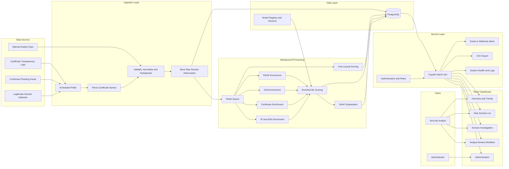
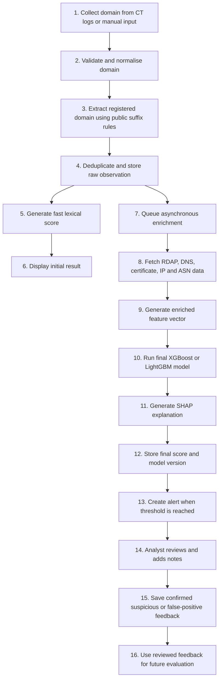
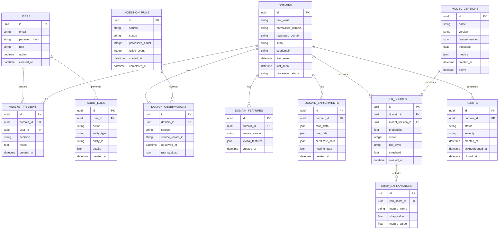

# AI-Powered Phishing Domain Detector  
## Complete Project Review, Problems, Improvements, and Working Architecture

**Project type:** Final-year capstone / deployable research prototype  
**Recommended product name:** **AI-Assisted Early-Risk Detection for Newly Observed Domains**

---

## 1. Executive Verdict

The project has a useful foundation, but it is **not yet a complete AI-powered phishing detection product**.

The current system already has:

- A FastAPI backend structure
- A React dashboard
- PostgreSQL and Redis services
- Docker Compose configuration
- A manual domain submission endpoint
- A domain details page
- A scheduled ingestion concept
- A scoring service
- A machine-learning training script

However, several important parts are missing, simulated, misleading, or not connected correctly.

The biggest issue is that the project currently looks like an AI system, but the actual machine-learning model is not properly trained, packaged, evaluated, or used reliably.

The project should be completed as a **realistic security-analysis prototype**, not as a production-grade global phishing protection platform.

---

## 2. What Is Already Good

The following parts should be kept and improved:

- Clear separation between backend and frontend
- FastAPI REST API structure
- React dashboard foundation
- PostgreSQL database
- Redis service
- Docker Compose setup
- Manual domain analysis
- Domain details page
- Scheduled ingestion idea
- Environment-based settings
- Risk score storage
- Modular backend files
- Basic feature extraction
- Initial documentation and proposal

The project does **not** need to be restarted from zero.

---

## 3. Main Problems Found

# 3.1 The Project Does Not Currently Use a Reliable Trained AI Model

The backend expects a model file such as:

```text
backend/models/phishing_model.pkl
```

If that model file is missing, the application falls back to a simple rule-based scoring system.

That means the running application may not actually use machine learning.

### Example problem

A weak heuristic model can produce results such as:

| Domain | Example risk score |
|---|---:|
| `paypal.com` | 60 |
| `paypa1.com` | 40 |
| `secure-paypal-login.com` | 60 |
| `random-new-business.co.nz` | 20 |

This is not acceptable because an official legitimate domain may receive a higher risk score than a suspicious typo-squatting domain.

### Required fix

- Train a real model using valid datasets.
- Save the complete model pipeline.
- Fail clearly when the model is unavailable.
- Do not silently pretend that fallback rules are AI.
- Show the active model version in the API and dashboard.

---

# 3.2 The Training Dataset Is Not Realistic

The current training approach appears to generate artificial examples instead of loading a strong real-world dataset.

A small number of unique domain patterns may be repeated many times.

This creates **data leakage** when duplicated or nearly identical examples appear in both training and testing sets.

The model may report extremely high accuracy while failing on new domains.

### Why this is dangerous

The model can memorise examples instead of learning real phishing behaviour.

For example:

- Known training pattern: detected correctly
- Slightly different typo domain: missed
- Normal new business domain: incorrectly marked as phishing

### Required fix

Use separate data groups:

## Confirmed phishing domains

Possible sources:

- PhishTank
- OpenPhish, subject to access and licensing
- Other approved academic or public sources

## Known legitimate domains

Possible sources:

- Tranco
- Government domains
- Education domains
- Verified company domains
- Other legitimate-domain datasets

## Newly observed unconfirmed domains

Possible source:

- Certificate Transparency logs

These should not automatically be labelled as legitimate. They should be treated as:

```text
unconfirmed
```

---

# 3.3 Random Train/Test Splitting Can Produce Misleading Results

A random 80:20 split is weak for this cybersecurity project.

Similar domains from one phishing campaign may appear in both training and testing data.

### Better approach

Use a time-based split:

```text
Oldest data     -> Training set
Newer data      -> Validation set
Newest data     -> Final unseen test set
```

Also:

- Deduplicate domains before splitting.
- Keep related campaign domains in the same split.
- Do not allow the same registered domain to appear in multiple splits.
- Save the exact dataset version used for every experiment.

---

# 3.4 SHAP Is Claimed but Not Properly Implemented

The dashboard may display a title such as:

```text
Risk Explanation (SHAP)
```

However, multiplying global feature importance by feature values is **not SHAP**.

SHAP should provide a local explanation for one individual prediction.

### Temporary fix

Rename the section to:

```text
Risk Factors
```

### Correct long-term fix

Use:

```python
shap.TreeExplainer(model)
```

For each prediction, store:

- Base prediction value
- SHAP value for each feature
- Top positive risk contributors
- Top negative contributors
- Model version
- Prediction threshold

---

# 3.5 Certificate Transparency Is Not a Complete Newly Registered Domain Feed

Certificate Transparency logs show domains included in issued TLS certificates.

They do **not** show every newly registered domain.

A domain may be registered without receiving a certificate.

### Incorrect claim

```text
The system monitors all newly registered domains.
```

### Better claim

```text
The system monitors newly observed certificate domains from Certificate Transparency logs.
```

### Recommended prototype approach

Use Certificate Transparency for the capstone MVP because it is publicly accessible and suitable for demonstration.

For a commercial product, a true Newly Registered Domain feed would normally require:

- Registry zone access
- A commercial domain-intelligence provider
- A client-provided source
- A licensed NRD feed

---

# 3.6 The Current Ingestion Logic Is Too Narrow

A query such as:

```text
https://crt.sh/?q=paypal&output=json
```

only searches for certificate records related to a specific term.

It is not a complete monitoring pipeline.

Other risks include:

- Historical certificates being treated as new
- Reprocessing the same certificates
- No stable ingestion cursor
- No reliable last-processed timestamp
- Multiple certificate names being stored as one string
- Wildcard domains not being normalised
- Fake fallback data being mixed with real data

### Required fix

The ingestion service should:

1. Fetch records.
2. Parse each certificate name separately.
3. Remove wildcard prefixes such as `*.`.
4. Normalise domains.
5. Extract the registered domain correctly.
6. Deduplicate records.
7. Store source timestamp and certificate ID.
8. Track the last successfully processed record.
9. Label demo data clearly.
10. Never silently mix fake and real data.

---

# 3.7 WHOIS Should Be Replaced with RDAP

WHOIS is difficult to parse and is increasingly outdated for structured registration lookups.

Use:

```text
RDAP first
WHOIS only as a fallback
```

### RDAP advantages

- Structured JSON
- Easier to parse
- Better consistency
- Clear status fields
- Better suited to APIs

### Important limitation

Many registration fields can be redacted.

The model should not depend on always receiving:

- Registrant name
- Registrant email
- Full organisation details
- Privacy-service identity

---

# 3.8 External Enrichment Services Are Not Properly Connected

The final scoring pipeline should use more than lexical domain features.

Currently missing or incomplete:

- RDAP registration age
- Registrar information
- DNS records
- Name-server information
- IP resolution
- ASN information
- SSL certificate metadata
- Certificate issuer
- Certificate validity dates
- Hosting reputation
- Optional threat-intelligence signals

### Recommended enrichment features

## Registration features

- Domain age
- Registration status
- Registrar
- Registration update date
- Expiry date
- Privacy/redaction indicator, when available

## DNS features

- A record count
- AAAA record count
- MX record presence
- NS record count
- TXT record presence
- DNS resolution failure
- Time-to-live values

## Certificate features

- Certificate issuer
- First observed date
- Validity duration
- Subject Alternative Name count
- Wildcard certificate
- Certificate age

## Hosting features

- IP address
- ASN
- Hosting country
- Shared infrastructure indicators
- Optional reputation source

---

# 3.9 Domain Parsing Is Incorrect

Splitting a domain by dots and selecting the first section is not reliable.

Example:

```text
login.paypal.com
```

Incorrect interpretation:

```text
Base name = login
```

Correct interpretation:

```text
Subdomain = login
Registered label = paypal
Public suffix = com
Registered domain = paypal.com
```

For New Zealand domains:

```text
secure-company.co.nz
```

The suffix is:

```text
co.nz
```

not only:

```text
nz
```

### Required libraries

- `tldextract`
- `idna`
- `urllib.parse`
- `rapidfuzz`
- Optional Unicode confusable-character library

### Required domain-processing features

- URL validation
- Hostname extraction
- Lowercase conversion
- Trailing-dot removal
- Wildcard removal
- Punycode decoding
- Unicode normalisation
- Homoglyph detection
- Public-suffix-aware parsing
- IP address detection
- Domain length validation
- Label length validation

---

# 3.10 Sentence Transformers Are Not the Best First Choice

A domain name is not normal natural-language text.

Example:

```text
micr0soft-login-verification.xyz
```

A sentence transformer is usually less suitable than character-based modelling.

### Recommended lexical techniques

- Character n-gram TF-IDF
- Logistic Regression
- Levenshtein distance
- Jaro-Winkler similarity
- RapidFuzz similarity
- Punycode indicators
- Homoglyph detection
- Character entropy
- Digit ratio
- Hyphen count
- Suspicious token count
- Brand-token similarity

### Recommended two-stage model

## Model A: Fast lexical model

Runs immediately using the domain string.

Suggested approach:

```text
Character n-gram TF-IDF + Logistic Regression
```

## Model B: Enriched model

Runs after RDAP, DNS and certificate collection.

Suggested approach:

```text
XGBoost or LightGBM
```

The final score should be calibrated using validation results.

Do not manually choose weights without testing.

---

# 3.11 Redis Is Not Being Used as a Real Queue

Redis should be used for:

- Background jobs
- Retry management
- Caching
- Ingestion coordination
- Rate-limit protection

Using Redis only for a health check does not provide meaningful value.

### Recommended queue design

Use:

```text
Celery + Redis
```

or another suitable Python worker system.

Suggested queues:

```text
ingestion
fast_scoring
rdap_enrichment
dns_enrichment
certificate_enrichment
final_scoring
alerts
```

---

# 3.12 Slow External Calls Should Not Block the API

RDAP, DNS and certificate requests can be slow or unavailable.

They should not run synchronously inside a normal frontend request.

### Better design

1. Store the domain.
2. Generate a fast lexical score.
3. Return the initial result.
4. Queue background enrichment.
5. Update the final score later.
6. Refresh the dashboard automatically.

### Suggested processing states

```text
received
normalised
initially_scored
enrichment_pending
enriching
fully_scored
enrichment_failed
reviewed
closed
```

---

# 3.13 The Database Schema Is Incomplete

The project needs proper relationships and migration support.

### Important database tables

- `users`
- `roles`
- `domains`
- `domain_observations`
- `domain_features`
- `domain_enrichments`
- `risk_scores`
- `shap_explanations`
- `alerts`
- `analyst_reviews`
- `audit_logs`
- `model_versions`
- `ingestion_runs`
- `processing_errors`

### Important requirements

- Foreign keys
- Unique constraints
- Indexes
- Created and updated timestamps
- Model version
- Feature-pipeline version
- Decision threshold
- Data source
- Review status
- Retry count
- Last error message

### Database migrations

Use:

```text
Alembic
```

Do not create or update production schemas only with automatic ORM table creation.

---

# 3.14 The API Needs Security Improvements

The current API is suitable only for local development.

### Missing controls

- Authentication
- Role-based authorisation
- Request rate limiting
- Strong domain validation
- Maximum request length
- Safe pagination limits
- Restricted CORS
- Audit logs
- Secret management
- Secure error handling
- HTTPS in deployment
- Protected administrative endpoints

### Recommended roles

## Analyst

Can:

- View alerts
- Investigate domains
- Add notes
- Mark false positives
- Confirm suspicious domains
- Export results

## Administrator

Can:

- Manage users
- Change system settings
- Change alert thresholds
- View ingestion health
- Manage model versions
- View audit logs

---

# 3.15 The Dashboard Is Incomplete

The current dashboard foundation is useful, but a realistic product needs more functions.

### Required dashboard pages

## Overview

- Total domains processed
- High-risk count
- Medium-risk count
- Low-risk count
- Processing queue size
- Enrichment failures
- Last successful ingestion
- Recent alerts
- Trend chart

## Risk Domains

- Search
- Pagination
- Risk filter
- Date filter
- TLD filter
- Registrar filter
- Brand similarity filter
- Review status filter
- Processing status filter

## Domain Investigation

- Domain
- Registered domain
- Subdomain
- Risk scores
- Risk level
- Model version
- Top risk factors
- RDAP information
- DNS information
- Certificate information
- Processing history
- Analyst notes
- Review action buttons

## Alerts

- Open alerts
- Acknowledged alerts
- Confirmed suspicious
- False positives
- Closed alerts

## System Health

- Data-source status
- Queue size
- Failed jobs
- API status
- Database status
- Redis status
- Model status
- Last ingestion time

---

# 3.16 Alerts and Exporting Are Missing

The final product should support:

- Email alerts
- Optional webhook alerts
- Configurable threshold
- Alert cooldown
- Duplicate-alert protection
- CSV export
- Selected-record export
- Audit record for exports

Do not build complex PDF reporting in the first MVP unless the core product is already complete.

---

# 3.17 Analyst Review Workflow Is Missing

A cybersecurity product should not only show a score.

It needs a human-review process.

### Recommended alert lifecycle

```text
New
  ↓
Under Review
  ↓
Confirmed Suspicious / False Positive / Needs More Information
  ↓
Closed
```

### Analyst actions

- Confirm suspicious
- Mark false positive
- Needs investigation
- Add note
- Assign analyst
- Close alert
- Reopen alert

This feedback can later improve model evaluation and retraining.

---

# 3.18 The Browser Extension Should Not Be Part of the Core MVP

A browser extension that sends every visited hostname to the backend introduces privacy and scope concerns.

### Risks

- Broad browsing-history access
- User consent requirements
- Data-retention concerns
- Manifest V3 service-worker state resets
- Additional testing burden
- Not directly related to monitoring newly observed domains

### Recommendation

Remove it from the core 12-week scope.

Keep it as:

```text
Future enhancement: browser-based domain lookup
```

---

# 3.19 There Are Not Enough Automated Tests

The project should include backend, frontend and end-to-end tests.

### Recommended backend test structure

```text
backend/tests/
├── test_domain_normalisation.py
├── test_feature_extractor.py
├── test_lexical_model.py
├── test_enriched_model.py
├── test_scorer.py
├── test_rdap_service.py
├── test_dns_service.py
├── test_certificate_service.py
├── test_ingestion.py
├── test_api_domains.py
├── test_api_auth.py
├── test_alert_service.py
└── test_database.py
```

### Recommended frontend tests

```text
frontend/src/
├── components/
│   └── __tests__/
├── pages/
│   └── __tests__/
└── services/
    └── __tests__/
```

Use:

- Vitest
- React Testing Library
- Mock Service Worker, if appropriate

### End-to-end tests

Use Playwright for:

1. Login
2. Submit a domain
3. View the initial score
4. Wait for enrichment
5. Open domain details
6. Add analyst notes
7. Mark review result
8. Export selected records

---

# 3.20 Dependency and Packaging Problems

Do not include generated folders or local development files in the project ZIP.

### Do not commit

```text
node_modules/
.git/
__pycache__/
.pytest_cache/
.DS_Store
.env
coverage/
dist/
build/
*.log
```

### Frontend dependency repair

If `npm ci` fails because the lock file is not synchronised:

```bash
cd frontend
rm -rf node_modules package-lock.json
npm install
npm run build
npm run lint
```

Then commit:

```text
package-lock.json
```

Do not commit:

```text
node_modules
```

---

## 4. Correct Working Architecture



---

## 5. End-to-End Working Flow



---

## 6. Recommended Technology Stack

| Area | Recommended technology |
|---|---|
| Main language | Python 3.11 or 3.12 |
| API | FastAPI |
| Server | Uvicorn |
| Validation | Pydantic |
| ORM | SQLAlchemy |
| Migrations | Alembic |
| Database | PostgreSQL |
| Queue and cache | Redis |
| Background workers | Celery |
| Scheduling | Celery Beat or APScheduler |
| Data processing | Pandas and NumPy |
| Baseline ML | Scikit-learn Logistic Regression |
| Enriched ML | XGBoost or LightGBM |
| Explainability | SHAP |
| Domain parsing | tldextract and idna |
| String similarity | RapidFuzz |
| DNS | dnspython |
| HTTP client | httpx |
| Frontend | React with TypeScript and Vite |
| API state | TanStack Query |
| UI components | Material UI or one consistent UI library |
| Charts | Chart.js |
| Backend testing | pytest |
| Frontend testing | Vitest and React Testing Library |
| End-to-end testing | Playwright |
| Local deployment | Docker Compose |
| CI/CD | GitHub Actions |
| Error monitoring | Sentry or similar |
| Metrics | Prometheus |
| Dashboards | Grafana |
| Logging | Structured JSON logging |

---

## 7. Recommended Folder Structure

```text
project-alpha/
├── backend/
│   ├── app/
│   │   ├── api/
│   │   │   ├── routes/
│   │   │   └── dependencies/
│   │   ├── core/
│   │   │   ├── config.py
│   │   │   ├── security.py
│   │   │   └── logging.py
│   │   ├── database/
│   │   │   ├── models/
│   │   │   ├── repositories/
│   │   │   └── session.py
│   │   ├── domain/
│   │   │   ├── normaliser.py
│   │   │   ├── lexical_features.py
│   │   │   └── brand_similarity.py
│   │   ├── enrichment/
│   │   │   ├── rdap.py
│   │   │   ├── dns.py
│   │   │   ├── certificates.py
│   │   │   └── asn.py
│   │   ├── ml/
│   │   │   ├── lexical_model.py
│   │   │   ├── enriched_model.py
│   │   │   ├── explanations.py
│   │   │   └── model_registry.py
│   │   ├── ingestion/
│   │   │   ├── ct_client.py
│   │   │   ├── parser.py
│   │   │   └── scheduler.py
│   │   ├── workers/
│   │   │   ├── tasks.py
│   │   │   └── celery_app.py
│   │   ├── alerts/
│   │   │   ├── email.py
│   │   │   └── webhooks.py
│   │   ├── services/
│   │   ├── schemas/
│   │   └── main.py
│   ├── alembic/
│   ├── models/
│   ├── scripts/
│   │   ├── prepare_dataset.py
│   │   ├── train_lexical_model.py
│   │   ├── train_enriched_model.py
│   │   └── evaluate_models.py
│   ├── tests/
│   ├── requirements.txt
│   └── Dockerfile
├── frontend/
│   ├── src/
│   │   ├── components/
│   │   ├── pages/
│   │   ├── services/
│   │   ├── hooks/
│   │   ├── types/
│   │   ├── routes/
│   │   └── tests/
│   ├── package.json
│   └── Dockerfile
├── deployment/
│   ├── docker-compose.yml
│   ├── nginx.conf
│   └── env.example
├── docs/
│   ├── architecture.md
│   ├── api.md
│   ├── data-dictionary.md
│   ├── deployment.md
│   ├── model-card.md
│   ├── testing.md
│   └── user-guide.md
├── .github/
│   └── workflows/
│       ├── backend-tests.yml
│       ├── frontend-tests.yml
│       └── security-scan.yml
├── .gitignore
├── README.md
└── LICENSE
```

---

## 8. Recommended Database Design



---

## 9. Correct Machine-Learning Plan

# 9.1 Data Preparation

1. Collect confirmed phishing domains.
2. Collect legitimate domains.
3. Collect newly observed unconfirmed domains.
4. Normalise all domains.
5. Remove duplicates.
6. Remove malformed values.
7. Record source and observation date.
8. Prevent related domains from leaking across splits.
9. Create time-based train, validation and test sets.
10. Save dataset version and processing script.

---

# 9.2 Baseline Model

Start with:

```text
Character n-gram TF-IDF + Logistic Regression
```

Why:

- Fast
- Easy to explain
- Strong for short text strings
- Good benchmark
- Low infrastructure cost

---

# 9.3 Enriched Model

Compare:

- Random Forest
- XGBoost
- LightGBM

Use structured features from:

- Lexical analysis
- RDAP
- DNS
- Certificates
- Hosting and ASN data

Deploy only the best model after fair evaluation.

---

# 9.4 Evaluation Metrics

Do not use accuracy alone.

Report:

- Precision
- Recall
- F1 score
- PR-AUC
- ROC-AUC
- False-positive rate
- False negatives
- False positives per 1,000 domains
- Processing latency
- Alert volume per day

Also report performance for:

- Brand impersonation
- Typo-squatting
- Punycode domains
- Random-looking domains
- Normal newly created businesses
- Country-code domains such as `.co.nz`

---

# 9.5 Model Artefacts

Save the complete pipeline:

```text
models/
├── lexical_pipeline.joblib
├── enriched_pipeline.joblib
├── feature_schema.json
├── brand_list.json
├── model_metadata.json
├── evaluation_report.json
└── model_card.md
```

`model_metadata.json` should include:

```json
{
  "model_name": "enriched-lightgbm",
  "version": "1.0.0",
  "feature_version": "1.0.0",
  "threshold": 0.78,
  "trained_at": "YYYY-MM-DD",
  "dataset_version": "dataset-v1",
  "metrics": {
    "precision": 0.91,
    "recall": 0.86,
    "f1": 0.88,
    "pr_auc": 0.92
  }
}
```

The numbers above are only an example. Actual values must come from evaluation.

---

## 10. Realistic Success Criteria

### Model criteria

- Outperform a Logistic Regression baseline.
- Evaluate on a time-based unseen test set.
- Report all important classification metrics.
- Document known limitations.
- Store model and feature versions.
- Provide genuine local explanations for final predictions.

### System criteria

- No duplicate domain observations from the same source record.
- Initial lexical score produced within five seconds after ingestion.
- Enriched score produced within 60 seconds when external sources respond normally.
- Failed enrichment tasks retry safely.
- The system clearly shows partial data.
- The dashboard updates without a full manual reload.
- Every final score includes a model version.
- Every alert can be reviewed and closed.

### Security criteria

- Authentication required.
- Role-based permissions enforced.
- Secrets not committed.
- CORS restricted.
- Inputs validated.
- API rate limits applied.
- Suspicious domains displayed as non-clickable text.
- Audit logs stored.
- HTTPS used in deployment.

---

## 11. Recommended API Endpoints

```text
POST   /api/v1/auth/login
POST   /api/v1/auth/logout
GET    /api/v1/auth/me

POST   /api/v1/domains
GET    /api/v1/domains
GET    /api/v1/domains/{domain_id}
POST   /api/v1/domains/{domain_id}/rescore

GET    /api/v1/alerts
GET    /api/v1/alerts/{alert_id}
PATCH  /api/v1/alerts/{alert_id}

POST   /api/v1/domains/{domain_id}/reviews
GET    /api/v1/domains/{domain_id}/reviews

GET    /api/v1/dashboard/summary
GET    /api/v1/dashboard/trends

GET    /api/v1/system/health
GET    /api/v1/system/ingestion-runs
GET    /api/v1/system/model

GET    /api/v1/export/domains.csv
GET    /api/v1/export/alerts.csv

GET    /api/v1/admin/users
POST   /api/v1/admin/users
PATCH  /api/v1/admin/users/{user_id}
```

---

## 12. API Response Example

```json
{
  "id": "domain-uuid",
  "domain": "secure-paypa1-login.example",
  "registered_domain": "secure-paypa1-login.example",
  "processing_status": "fully_scored",
  "initial_score": {
    "score": 76,
    "probability": 0.76,
    "model_version": "lexical-1.0.0"
  },
  "final_score": {
    "score": 91,
    "probability": 0.91,
    "risk_level": "high",
    "threshold": 0.78,
    "model_version": "enriched-1.0.0"
  },
  "top_risk_factors": [
    {
      "feature": "brand_similarity_paypal",
      "value": 0.94,
      "shap_value": 0.31
    },
    {
      "feature": "domain_age_days",
      "value": 1,
      "shap_value": 0.22
    },
    {
      "feature": "suspicious_token_count",
      "value": 2,
      "shap_value": 0.18
    }
  ],
  "enrichment": {
    "rdap_status": "complete",
    "dns_status": "complete",
    "certificate_status": "complete"
  },
  "created_at": "YYYY-MM-DDTHH:MM:SSZ",
  "updated_at": "YYYY-MM-DDTHH:MM:SSZ"
}
```

---

## 13. Recommended 12-Week Development Plan

# Weeks 1–2: Scope, Architecture and Setup

- Finalise MVP scope.
- Confirm client requirements.
- Confirm dataset licences.
- Clean repository.
- Create environment files.
- Design database.
- Add Alembic.
- Create Docker development environment.
- Build a small CT ingestion proof of concept.

### Deliverables

- Approved architecture
- Product backlog
- Database diagram
- Repository structure
- Working local environment

---

# Weeks 3–4: Data and Domain Processing

- Build domain normalisation.
- Add public-suffix parsing.
- Add Punycode handling.
- Add homoglyph features.
- Prepare phishing dataset.
- Prepare legitimate dataset.
- Deduplicate examples.
- Create time-based data split.
- Produce exploratory data analysis.

### Deliverables

- Versioned dataset
- Data dictionary
- Domain normalisation tests
- EDA report

---

# Weeks 5–6: Machine Learning

- Train Logistic Regression baseline.
- Add character n-gram features.
- Train Random Forest, XGBoost or LightGBM.
- Compare models.
- Calibrate probabilities.
- Select threshold.
- Create model card.
- Save model artefacts.

### Deliverables

- Evaluation report
- Final selected model
- Model metadata
- Reproducible training scripts

---

# Week 7: Enrichment Pipeline

- Add RDAP.
- Add DNS.
- Add certificate data.
- Add IP and ASN enrichment.
- Add Redis queue.
- Add retries.
- Add caching.
- Add processing status.

### Deliverables

- Working background workers
- Enrichment integration tests
- Failure-handling demonstration

---

# Weeks 8–9: Backend and Dashboard

- Complete FastAPI endpoints.
- Add authentication.
- Add role permissions.
- Build overview dashboard.
- Build risk-domain table.
- Build domain investigation page.
- Add filters.
- Add analyst-review workflow.
- Add CSV export.

### Deliverables

- Integrated frontend and backend
- Analyst workflow
- Protected routes
- Working export

---

# Week 10: Explainability and Alerts

- Add genuine SHAP.
- Add top risk factors.
- Add email alerts.
- Add webhook option if time permits.
- Add alert cooldown.
- Add ingestion health page.
- Add model version display.

### Deliverables

- Explainable predictions
- Working alerts
- System health page

---

# Week 11: Testing and Refinement

- Unit tests
- API integration tests
- Frontend component tests
- Playwright end-to-end tests
- Performance testing
- Security review
- Client UAT
- Fix priority defects

### Deliverables

- Test report
- UAT results
- Defect log
- Performance report

---

# Week 12: Deployment and Handover

- Deploy with Docker.
- Configure HTTPS.
- Complete user guide.
- Complete deployment guide.
- Complete model card.
- Complete known-limitations report.
- Record demo.
- Prepare final presentation.
- Complete code handover.

### Deliverables

- Deployed prototype
- Final report
- Presentation
- User guide
- Technical documentation

---

## 14. MVP Scope

The following features should be completed first:

- Certificate Transparency ingestion
- Manual domain submission
- Domain validation and normalisation
- Deduplication
- Fast lexical score
- RDAP enrichment
- DNS enrichment
- Certificate enrichment
- Enriched ML score
- Genuine explanation
- React dashboard
- Domain investigation page
- Analyst-review workflow
- Authentication and roles
- Email alert
- CSV export
- Docker deployment
- Automated tests

---

## 15. Out of Scope for the First Version

Do not include these in the core 12-week MVP:

- Monitoring every newly registered domain globally
- Production-grade live streaming
- Automatic domain blocking
- SIEM integration
- Mobile application
- Browser extension
- Webpage screenshot analysis
- Malware sandboxing
- Large language model
- Automatic continuous retraining
- Multi-tenant enterprise support
- Advanced threat-intelligence subscriptions
- Automated takedown requests

These can be listed under:

```text
Future Enhancements
```

---

## 16. Security Checklist

- [ ] Use environment variables for secrets.
- [ ] Add `.env` to `.gitignore`.
- [ ] Provide `.env.example` without real passwords.
- [ ] Use strong database passwords.
- [ ] Do not expose Redis publicly.
- [ ] Do not expose PostgreSQL publicly in production.
- [ ] Restrict CORS to the deployed frontend.
- [ ] Validate domain inputs.
- [ ] Limit request body size.
- [ ] Limit API pagination.
- [ ] Add login rate limiting.
- [ ] Add API rate limiting.
- [ ] Store passwords with a secure password hash.
- [ ] Use short-lived access tokens.
- [ ] Add role-based permissions.
- [ ] Use HTTPS.
- [ ] Add structured audit logs.
- [ ] Do not make suspicious domains clickable.
- [ ] Avoid fetching arbitrary web pages from user-provided URLs.
- [ ] Scan dependencies.
- [ ] Run security checks in CI.
- [ ] Document data retention.
- [ ] Document deletion procedures.

---

## 17. Testing Checklist

### Domain normalisation

- [ ] Uppercase domain
- [ ] Full URL input
- [ ] URL with path
- [ ] URL with query string
- [ ] Domain with trailing dot
- [ ] Wildcard domain
- [ ] Punycode domain
- [ ] Unicode domain
- [ ] `.co.nz` domain
- [ ] Too-long domain
- [ ] Too-long label
- [ ] Invalid characters
- [ ] IP address
- [ ] Empty input

### Machine learning

- [ ] Model file loads
- [ ] Missing model produces a visible error
- [ ] Feature order is stable
- [ ] Unknown category handled
- [ ] Probability stays between 0 and 1
- [ ] Threshold applied correctly
- [ ] Model version saved
- [ ] Explanation matches selected model
- [ ] Duplicate test data removed
- [ ] Time-based holdout used

### Ingestion

- [ ] Source unavailable
- [ ] Empty response
- [ ] Malformed JSON
- [ ] Duplicate certificate
- [ ] Multiple names in one certificate
- [ ] Wildcard domain
- [ ] Historical record
- [ ] Retry limit reached
- [ ] Cursor saved
- [ ] Partial processing recovered

### Enrichment

- [ ] RDAP success
- [ ] RDAP timeout
- [ ] RDAP rate limit
- [ ] DNS success
- [ ] NXDOMAIN
- [ ] Certificate missing
- [ ] ASN lookup unavailable
- [ ] Cached result used
- [ ] Partial data accepted
- [ ] Error status displayed

### Dashboard

- [ ] Login
- [ ] Logout
- [ ] Domain list
- [ ] Pagination
- [ ] Search
- [ ] Risk filter
- [ ] Date filter
- [ ] Domain details
- [ ] Initial score
- [ ] Final score
- [ ] Explanation
- [ ] Analyst note
- [ ] False-positive decision
- [ ] Alert status
- [ ] CSV export
- [ ] System health
- [ ] Mobile layout
- [ ] Loading states
- [ ] Error states

---

## 18. Recommended CI/CD Checks

Every pull request should run:

```text
Backend formatting
Backend linting
Backend type checking
Backend unit tests
Database migration check
Frontend linting
Frontend unit tests
Frontend build
End-to-end smoke test
Dependency vulnerability scan
Secret scan
Docker image build
```

Suggested tools:

- Ruff
- Black
- MyPy
- pytest
- ESLint
- Vitest
- Playwright
- Dependabot
- Trivy
- Gitleaks
- GitHub Actions

---

## 19. Documentation Required for Final Handover

- `README.md`
- Product requirements
- Architecture document
- Database design
- API documentation
- Data dictionary
- Dataset sources and licences
- Model card
- Evaluation report
- Test report
- Security review
- Deployment guide
- User guide
- Administrator guide
- Known limitations
- Future improvements
- Client UAT report

---

## 20. Recommended Product Description

> The system monitors newly observed certificate domains and accepts manually submitted domains for analysis. It performs immediate lexical risk scoring, followed by asynchronous RDAP, DNS, certificate, IP and ASN enrichment. An enriched machine-learning model produces a final phishing-risk score with feature-level explanations. Security analysts can investigate, filter, review and export alerts through a protected web dashboard. The system provides decision support and does not automatically block domains.

---

## 21. Final Recommendation

Continue with the project, but make the following changes before calling it a finished AI product:

1. Replace the synthetic training process.
2. Create a valid time-based dataset split.
3. Package and load the real trained model.
4. Fix domain parsing.
5. Replace WHOIS-first logic with RDAP.
6. Connect background enrichment.
7. Use Redis as a real queue.
8. Add genuine SHAP explanations.
9. Add authentication and analyst roles.
10. Complete the dashboard.
11. Add alerts and CSV exporting.
12. Add database migrations and foreign keys.
13. Add automated tests.
14. Remove the browser extension from the MVP.
15. Present Certificate Transparency honestly as newly observed certificate domains.

The finished result should be described as a:

```text
Deployable AI-assisted phishing-domain risk analysis prototype
```

It should not be presented as:

```text
A complete production system that detects every newly registered phishing domain
```

That smaller and more honest scope is achievable, academically strong, and suitable for demonstrating machine learning, backend development, frontend development, cybersecurity, software testing and deployment skills.
